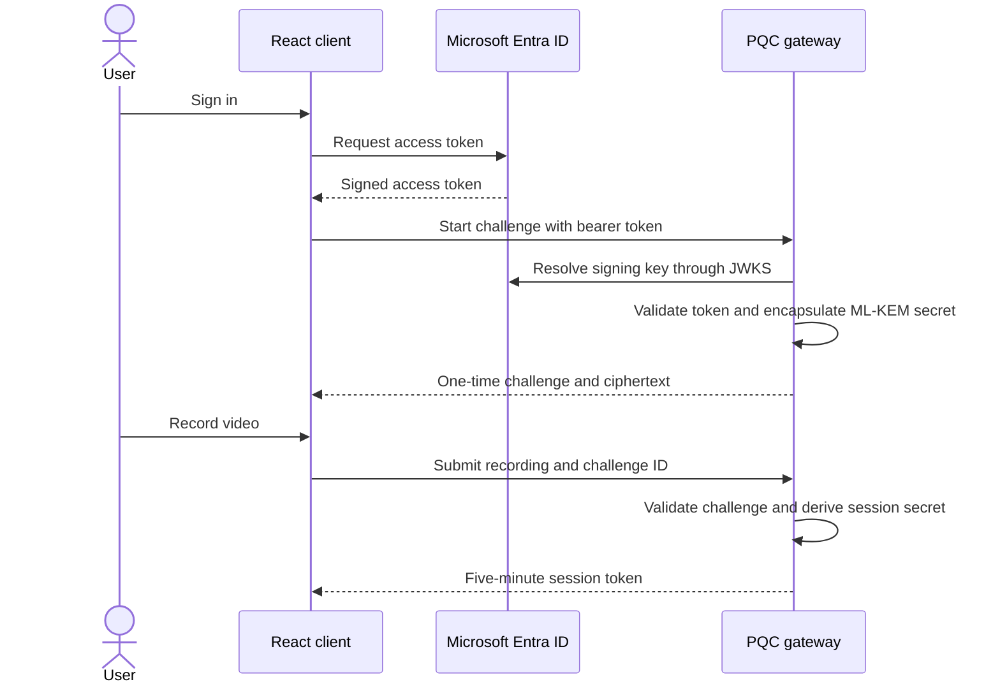

# PQC-AUTH

PQC-AUTH is an experimental authentication gateway that combines Microsoft Entra ID with an ML-KEM-1024 key encapsulation flow and a browser-based video challenge.

The project explores a practical question: how can an existing identity provider remain the entry point while a post-quantum mechanism contributes fresh key material to a short-lived application session?

> [!IMPORTANT]
> PQC-AUTH is a research prototype, not a production-ready authentication service. The current video check validates only that a sufficiently large recording was uploaded. It does not yet perform face matching, liveness detection, or biometric verification.

## What it demonstrates

- Sign-in through Microsoft Entra ID using MSAL
- Validation of Entra access tokens against Microsoft's JWKS endpoint
- ML-KEM-1024 key generation and encapsulation through the Node.js crypto API
- Single-use challenges with a five-minute validity window
- In-browser camera recording with the MediaRecorder API
- A short-lived session token derived from the ML-KEM shared secret
- Rejection of expired, reused, missing, and undersized challenge uploads

## Authentication flow



## Project structure

```text
PQC-AUTH/
├── frontend/                React 19 and Vite client
│   └── src/
│       ├── authConfig.ts    Microsoft Entra and MSAL settings
│       └── components/      Login, challenge, layout, and recorder UI
├── gateway/                 Express and TypeScript API
│   └── src/index.ts         Token validation and PQC challenge flow
└── test.mp4                 Prototype demonstration recording
```

## Technology

| Area | Implementation |
| --- | --- |
| Client | React 19, TypeScript, Vite |
| Identity | Microsoft Entra ID, MSAL |
| Gateway | Node.js, Express 5, TypeScript |
| Post-quantum mechanism | ML-KEM-1024 |
| Token verification | JSON Web Tokens and JWKS |
| Media capture | MediaRecorder and `getUserMedia` |

## Prerequisites

You will need:

- Node.js with native ML-KEM support in the `crypto` module
- npm
- A Microsoft Entra tenant
- An Entra single-page application registration
- An Entra API registration exposing the `pqc.access` scope
- A browser with camera and MediaRecorder support

The gateway calls `generateKeyPairSync("ml-kem-1024")` and `crypto.encapsulate()`. If either API is unavailable in your Node.js build, the gateway will not start.

## Microsoft Entra configuration

The repository currently contains development identifiers directly in:

- `frontend/src/authConfig.ts`
- `gateway/src/index.ts`

Before running your own deployment, replace them with values from your Entra tenant:

| Setting | Purpose |
| --- | --- |
| Tenant ID | Identifies the Entra tenant and accepted token issuer |
| SPA client ID | Identifies the browser application |
| API application ID URI | Defines the gateway token audience |
| API scope | Grants the client access to the PQC gateway |
| Redirect URI | Must match the local or deployed frontend URL |

For the current local setup, register `http://localhost:5173` as the SPA redirect URI and grant the frontend permission to request the API's `pqc.access` scope.

## Run locally

Clone the repository:

```bash
git clone https://github.com/Vishnu2707/PQC-AUTH.git
cd PQC-AUTH
```

Start the gateway:

```bash
cd gateway
npm install
npm run dev
```

In a second terminal, start the frontend:

```bash
cd frontend
npm install
npm run dev
```

Open `http://localhost:5173` and complete the following flow:

1. Sign in with a permitted Microsoft Entra account.
2. Select **Initialize PQC Session**.
3. Allow camera access.
4. Record a short video and select **Stop & Verify**.
5. Review the issued session ID, token, and expiry.

The gateway runs on `http://localhost:4000`. Its health endpoint is available at:

```bash
curl http://localhost:4000/health
```

An operational response should look similar to:

```json
{
  "status": "ok",
  "kem": "ready"
}
```

## API overview

### `POST /pqc/start`

Requires a valid Entra bearer token. The gateway verifies the token issuer, audience, signature, and algorithm before creating a one-time challenge.

Example response:

```json
{
  "challengeId": "chl_...",
  "user": "user@example.com",
  "kemAlg": "ML-KEM-1024",
  "kemCiphertext": "...",
  "sharedKeyPreview": "..."
}
```

### `POST /pqc/verify`

Accepts `multipart/form-data` containing:

- `challengeId`: the identifier returned by `/pqc/start`
- `video`: a browser recording of up to 50 MB

The gateway rejects unknown, expired, or reused challenges. A successful request consumes the challenge and returns a session token that expires after five minutes.

## Security status

This repository is intended for experimentation and technical discussion. Several controls must be completed before any production use:

- Replace the video-size check with a genuine, independently assessed liveness and identity-verification system.
- Move tenant, client, audience, origin, port, and lifetime settings into validated environment variables.
- Remove `sharedKeyPreview` and other cryptographic debug output.
- Replace in-memory challenge and session stores with a protected shared store that supports expiry and atomic consumption.
- Restrict CORS to explicitly trusted origins.
- Bind the proof step cryptographically to the client and challenge. The current client receives an encapsulated ciphertext but does not decapsulate it or prove possession of the resulting shared secret.
- Use an established session architecture and asymmetric signing or server-side opaque sessions instead of using the derived shared secret directly as an HS256 signing key.
- Add rate limiting, replay monitoring, structured audit logging, secure headers, upload content validation, and abuse controls.
- Define retention, consent, deletion, and access policies before processing real biometric material.
- Use HTTPS for every non-local deployment.
- Add automated tests, dependency scanning, secret scanning, and a documented security review process.

Do not use real biometric data or rely on the generated token to protect sensitive systems in the current version.

## Development commands

Frontend:

```bash
npm run dev
npm run build
npm run lint
npm run preview
```

Gateway:

```bash
npm run dev
npx tsc --noEmit
```

## Roadmap

- Complete client-side ML-KEM decapsulation and proof of key possession
- Implement standards-based challenge binding and transcript verification
- Integrate a real liveness provider behind a replaceable adapter
- Add Redis-backed challenge expiry and atomic single-use enforcement
- Introduce configuration validation and deployment profiles
- Add unit, integration, replay, and negative-path tests
- Add container images and continuous integration
- Publish a threat model and protocol specification

## Contributing

Issues and pull requests are welcome, particularly for protocol design, cryptographic review, threat modelling, identity integration, testing, and privacy controls.

For security-sensitive findings, avoid publishing exploit details in a public issue. Contact the maintainer privately first so the issue can be assessed and addressed responsibly.

## Author

Created and maintained by [Vishnu Ajith](https://github.com/Vishnu2707).

## Licence

No licence file is currently included in the repository. Until a licence is added, the source remains subject to the default protections of copyright law. If you intend to accept external contributions or encourage reuse, add an explicit open-source licence.
